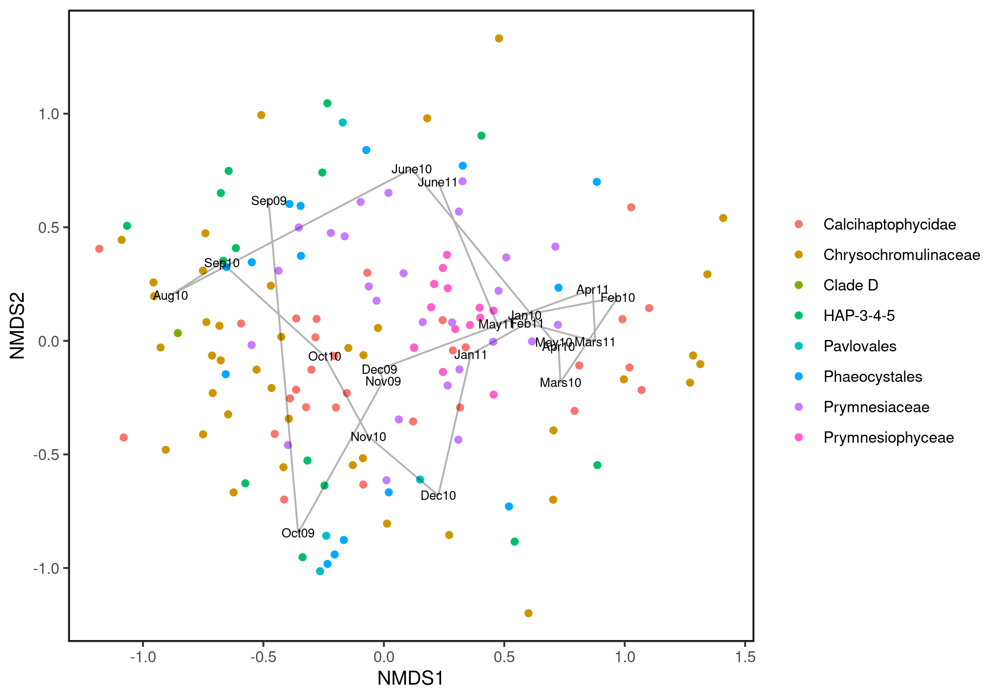

```{r setup, include=FALSE}
knitr::opts_chunk$set(echo = FALSE)
```
## Introduction
**Study used:**

Seasonal diversity and dynamics of haptophytes in the
Skagerrak, Norway, explored by high-throughput
sequencing

**Purpose:**

To investigate the seasonal variation of environmental factors and bacterial abundances using data visualisation tools

## Materials and methods
```{r, echo=FALSE,out.width="100%", out.height="20%",fig.cap="",fig.show='hold',fig.align='center'}

```

## Results - Seasonal Variation 1/2
{width=90%}

## Results - Seasonal Variation 2/2
{width=90%}

## Results - Abundance Analysis
```{r, echo=FALSE,out.width="65%", out.height="20%",fig.cap="",fig.show='hold',fig.align='center'}
knitr::include_graphics(c("../results/05_OTU_richness_of_the_major_haptophyte_groups.png","../results/05_Seasonal_variation_in_proportional_read_abundance.png"))
```

## Results - Heatmaps
```{r, echo=FALSE,out.width="50%", out.height="20%",fig.cap="",fig.show='hold',fig.align='center'}

```

## Results - NMDS
{width=85%}

## Results - Light-Temperature Cycle
{width=80%}


## Result - Modelling
```{r message = FALSE, warning = FALSE, fig.show='hold',fig.align='center'}
library(flextable)
library(tidyverse)
dat <- read.csv("../results/08_parameters_vs_temperature.csv") %>% t() %>% as.data.frame() %>% 
  mutate(rownames = c(" ","Coefficient", "P-value")) %>% 
  relocate(rownames)
regulartable(dat) %>% delete_part(part = "header")
```

```{r message = FALSE, warning = FALSE, fig.show='hold',fig.align='center', out.width = "55%"}
knitr::include_graphics("../results/08_phosphate_vs_temperature.png")
```

